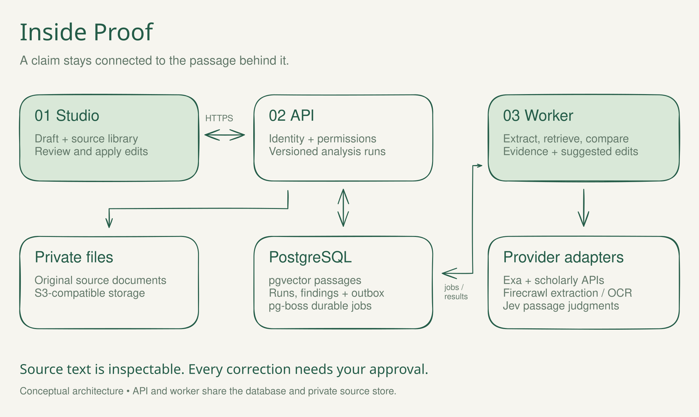

<p align="center">
  
</p>

<p align="center">
  <a href="https://app-proof.up.railway.app/app"><strong>Open Proof ↗</strong></a>
  &nbsp; · &nbsp;
  <a href="#follow-a-claim">Follow a claim</a>
  &nbsp; · &nbsp;
  <a href="#inside-proof">Architecture</a>
  &nbsp; · &nbsp;
  <a href="#run-it-locally">Run locally</a>
</p>

# Writing with evidence attached.

Proof checks the claims in your writing against source passages. Keep the draft in view, inspect what supports it, and apply a proposed correction with one click. You decide what changes.

<table>
<tr>
<td width="33%" valign="top">

### Read the text

Import a document or paste a draft. Select the source files and pages that the check should use.

</td>
<td width="33%" valign="top">

### Inspect the evidence

See each finding beside the sentence, with the source passage and an explanation you can check.

</td>
<td width="33%" valign="top">

### Make the correction

Review a proposed edit and apply it. Document versions preserve the history of your changes.

</td>
</tr>
</table>

## Follow a claim

Choose a step to look inside the workflow.

<details open>
<summary><strong>01 &nbsp; Start with your draft and sources</strong></summary>

Upload a PDF, Word document, Markdown file, or plain text. Choose a supplied-source check, discover research for a claim, or check against public academic sources. Set the scope and grant processing permission before running the analysis.

The source library keeps uploaded documents and extracted passages attached to your account. Chapter checks use confirmed physical PDF page ranges.

</details>

<details>
<summary><strong>02 &nbsp; Read the reason behind a finding</strong></summary>

A finding ties a claim to the passages used to assess it. **Supported** means the checked material supports the claim. **Unsupported** means that material does not establish it. An incomplete check explains what prevented a conclusion, such as unavailable source text or a provider failure.

Agreement with uploaded material does not establish that the material itself is true. Bibliographic metadata, search snippets, and inaccessible papers cannot establish support.

</details>

<details>
<summary><strong>03 &nbsp; Review and apply a proposed change</strong></summary>

Read the suggested change beside the original sentence and its evidence. Apply an available correction with one click, or edit the text yourself. Proof checks the document version before applying an edit. Changing the draft makes its previous analysis stale.

A finding without a safe correction stays available for manual review. Proof does not silently rewrite a document.

</details>

<details>
<summary><strong>04 &nbsp; Keep the sources and citation work together</strong></summary>

Import a bibliography, resolve article metadata, and format MLA citations. Keep the source passages available while reviewing the wording and references.

Citation formatting and evidence checking are separate. A correctly formatted reference does not establish the truth of its claim. Page locators and edition-specific mappings need the writer's confirmation.

</details>

## Inside Proof

<a href="docs/assets/readme/architecture.svg">
  
</a>

[View the full diagram](docs/assets/readme/architecture.svg) · [Download the editable Excalidraw scene](docs/assets/readme/architecture.excalidraw)

Open the scene in [Excalidraw](https://excalidraw.com) to move the components, annotate the flow, or export your own view.

| Layer | What it does | Built with |
| :--- | :--- | :--- |
| Studio | Drafts, source library, findings, approved edits | React 19, TypeScript, Vite |
| API | Sessions, ownership, consent, versioned runs | Express 5, WorkOS AuthKit |
| Worker | Extraction, retrieval, evidence judgments | Node.js, pg-boss |
| Data | Documents, runs, passages, job outbox | PostgreSQL, pgvector |
| Files | Original source documents | Private S3-compatible storage |

<details>
<summary><strong>Explore the provider adapters</strong></summary>

| Provider | Role |
| :--- | :--- |
| Exa | Web search and source discovery |
| OpenAlex | Scholarly discovery and article records |
| Crossref | DOI resolution and bibliographic metadata |
| Europe PMC | Abstracts and available open-access full text |
| DOAJ | Journal policy records for academic eligibility checks |
| Firecrawl | Document extraction and OCR |
| Jev / TypeSafe | Bounded judgments over claims and retrieved passages |

Provider calls depend on the chosen mode, available credentials, source access, and the user's processing permission. Academic eligibility and supplied-material checks use different source policies. A failed provider call cannot become a supported finding.

</details>

<details>
<summary><strong>Understand storage, consent, and check limits</strong></summary>

The persistent backend stores account-owned documents, versions, source metadata, passages, findings, and progress in PostgreSQL. Private object storage holds original source files. A durable outbox and pg-boss queue connect the API to the worker.

Each run freezes its selected sources. External research and provider processing follow the permissions selected for that run. The local extraction path remains available for uploads without external-processing permission.

Text extraction can miss figures, tables, equations, and complex page layouts. Retrieved passages can omit context. Model judgments can be wrong. Read the original source before relying on a finding.

See the [run contracts](shared/backend.ts), [backend configuration and limits](server/backend/config.ts), and [environment reference](.env.example).

</details>

## Run it locally

Use **Node.js 22 or later**. Open the repository in Cursor to load the [project rules](.cursor/rules/proof.mdc).

```sh
npm ci
cp .env.example .env
```

Set `TYPESAFE_API_KEY` in your local `.env` for Jev judgments. Configure optional provider keys for the workflows you want to use. Then start the app with explicit environment loading:

```sh
node --env-file=.env --import tsx server/dev.ts
```

Open [localhost:4317/app](http://127.0.0.1:4317/app). `npm run dev` (or `server/dev.ts` with explicit environment loading) starts a persistent embedded PostgreSQL database and the real job worker when `DATABASE_URL` is unset. Local data stays in `.data/database` and source files in `.data/library`. Existing browser drafts migrate into that workspace when it opens; the browser keeps their original text as a backup. No additional database installation is required. Set `PROOF_LOCAL_BACKEND=false` to use browser-only drafts instead.

When `DATABASE_URL` is configured, the app uses that PostgreSQL service and needs the separate worker below. The embedded workspace is restricted to local development.

<details>
<summary><strong>Run the API, worker, and database with Docker</strong></summary>

With Docker running and your `.env` configured:

```sh
docker compose -f compose.backend.yml up --build
```

Compose starts the API, worker, and PostgreSQL with pgvector. It loads `.env` and shares a local source-file volume between the API and worker. This is the local development configuration. Hosted deployments require private object storage.

See [compose.backend.yml](compose.backend.yml) and [.env.example](.env.example).

</details>

<details>
<summary><strong>Configure hosted sign-in and deployment</strong></summary>

Deploy the web service and worker from the same revision. Share `DATABASE_URL`, provider configuration, and private bucket credentials between them. Set `PROOF_HOSTED=true` and `PROOF_USE_KEYCHAIN=false`.

For AuthKit, configure all four settings: `WORKOS_API_KEY`, `WORKOS_CLIENT_ID`, `WORKOS_REDIRECT_URI`, and `WORKOS_COOKIE_PASSWORD`. Register the exact callback URL with WorkOS. Partial configuration prevents startup.

The worker uses `PROOF_PROCESS=worker` and `npm run worker`. It needs no public domain. The web service exposes `/health`. Hosted startup requires private S3-compatible storage. Legacy username accounts still use a file store, so keep one web replica and its persistent account volume.

Run the database migrations with `npm run db:migrate`. After deployment, check web health, worker job consumption, a source upload, and a completed analysis.

Railway's production web, worker, and landing services connect to `zabrodsk/proof` on `main`. A push to `main`, including a merged pull request, triggers all three deployments. Pushes to other branches do not deploy production. Railway builds each service from the GitHub revision, so uncommitted local files are not deployed. This uses [Railway's GitHub autodeploys](https://docs.railway.com/deployments/github-autodeploys) and needs no Railway token in GitHub Actions.

To restore these connections and service settings, sign in with `railway login` and run `bash scripts/configure-railway.sh`. The web and worker use `Dockerfile`; the landing uses `Dockerfile.landing`. Only web and landing have an HTTP healthcheck. The script targets the existing production services and retains their variables, volumes, and domains. Railway's deprecated `railway.json` files are removed so the worker does not inherit the web healthcheck.

Configuration: [deployment setup](scripts/configure-railway.sh) · [Docker image](Dockerfile) · [landing image](Dockerfile.landing) · [environment](.env.example)

</details>

<details>
<summary><strong>Configure PostHog</strong></summary>

Analytics starts disabled. After approving the destination and event payload, set these runtime variables on Railway's `proof-web` and `proof-landing` services:

```sh
PROOF_POSTHOG_ENABLED=true
PROOF_POSTHOG_TOKEN=phc_your_public_project_token
PROOF_POSTHOG_HOST=https://eu.i.posthog.com
```

Use `https://us.i.posthog.com` for a US project. The browser reads only this public configuration from `/api/analytics/config`; never supply a personal API key. Railway must redeploy after runtime-variable changes, but the frontend needs no rebuild to embed them. Set `PROOF_POSTHOG_ENABLED=false` to turn collection off.

Events are `$pageview`, `document_created`, `source_uploaded`, `check_started`, `corrections_applied`, and `document_exported`. Every event has `app=proof`, which separates Proof from other products in a shared PostHog project. Other properties are route templates, aggregate counts, check modes, media types, and export formats. A property allowlist strips document text, titles, filenames, account details, referrers, raw URLs, and query strings. Analytics uses memory only, respects Do Not Track, and disables autocapture, session replay, error capture, surveys, and feature flags. Reloading starts a new anonymous identity, so cross-session retention and user attribution are unavailable. SDK or network failures do not block the app.

See [PostHog SDK configuration](https://posthog.com/docs/references/posthog-js/types/PostHogConfig). Unit tests cover the configuration gate and property filtering; browser tests intercept every PostHog request and use synthetic data.

</details>

<details>
<summary><strong>Enable integrations and remote MCP</strong></summary>

Set `PROOF_INTEGRATIONS_ENABLED=true` to enable the integrations page and its API. Remote `/mcp` also requires `PROOF_MCP_ENABLED=true` and an OAuth server configured for authorization-code flow, S256 PKCE, platform clients, scopes, audience, and introspection.

WorkOS browser sign-in alone does not configure connector OAuth. Platform grants share selected source IDs and can be revoked. ChatGPT and Claude certification remain release gates.

See the [connector implementation record](docs/proof-connector-implementation.html) and [.env.example](.env.example).

</details>

## Work on Proof

```sh
npm test
npm run test:backend
npm run build
npm run format:check
```

Regular tests use fixtures and stubbed provider responses. Opt-in live checks call real providers and consume API usage. Run `npm run test:live` or `npm run test:firecrawl` only with the corresponding credentials configured in the process environment.

| Directory | Start here |
| :--- | :--- |
| [`src/`](src/) | Studio and the React interface |
| [`server/backend/`](server/backend/) | Persistent analysis, retrieval, and storage |
| [`server/integrations/`](server/integrations/) | Platform grants and connector APIs |
| [`shared/`](shared/) | Shared types and run contracts |
| [`tests/`](tests/) | Evidence, backend, and integration checks |
| [`site/`](site/) | Separate landing page and waitlist |
| [`docs/assets/readme/`](docs/assets/readme/) | Cover, editable diagram, and asset notes |

The earlier class workspace remains at `/app/class`; the earlier evidence editor remains at `/app/evidence`. Their storage and limits differ from persistent Studio.

---

<p align="center">
  <strong>Keep the sentence. Inspect the source. Decide what changes.</strong><br><br>
  <a href="https://app-proof.up.railway.app/app">Open Proof ↗</a>
  &nbsp; · &nbsp;
  <a href="https://proof-evidence.up.railway.app">Visit the site</a>
  &nbsp; · &nbsp;
  <a href="docs/assets/readme/SOURCES.md">About the visuals</a>
</p>
